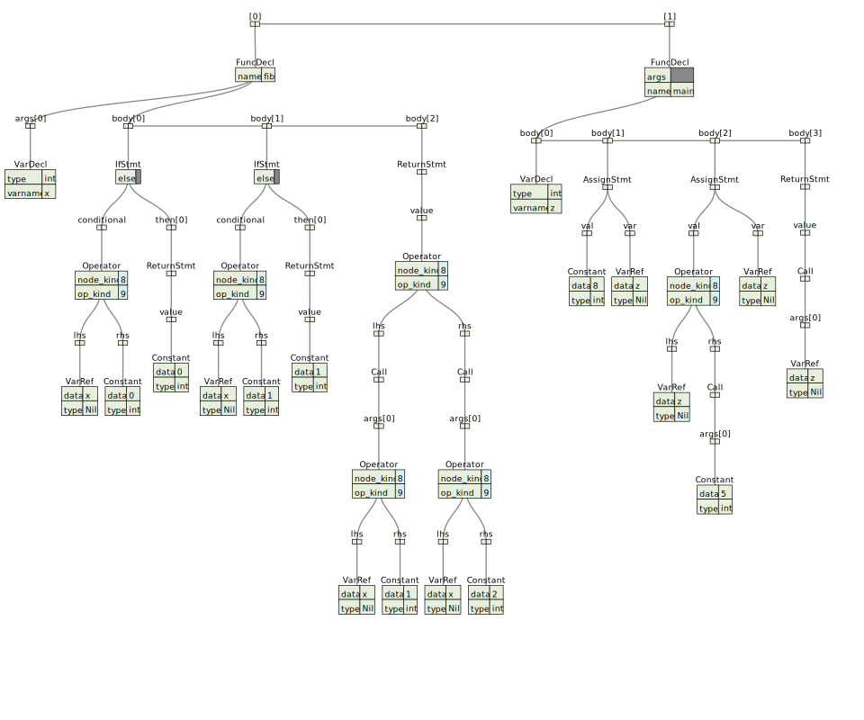

# fx
a go-like language

## build
```shell
git clone https://github.com/iohub/fx && cd fx
git submodule init && git submodule update
mkdir build_ninja
cd build_ninja
cmake -G Ninja .. -DCMAKE_BUILD_TYPE=Release -DCMAKE_EXPORT_COMPILE_COMMANDS=On
ninja
```
## run
```shell
./fx --file ../examples/demo.rb
```

## visualize
```ruby

def fib(int x) int {
    if (x <= 0) {
        return 0
    }
    if (x == 1) {
        return 1
    }
    return fib(x-1) + fib(x-2)
}

def main() int {
    int z
    z = 8
    z = z + fib(5)
    return fib(z)
}
```

* simple typed ast


## reference

1. **Type infer**
http://www.cse.chalmers.se/edu/year/2011/course/CompFun/lecture4.pdf
2. **Yacc grammar**
https://www.lysator.liu.se/c/ANSI-C-grammar-y.html
3. **Type checker** https://jaked.org/blog/2021-09-15-Reconstructing-TypeScript-part-1
4. **Bidirectional Type Checking** https://www.youtube.com/watch?v=utyBNDj7s2w
