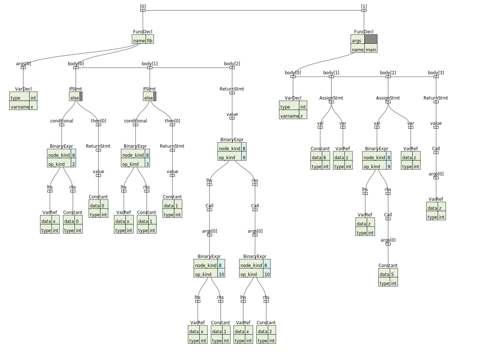

# fx
a static strong typed language

## build
```shell
git clone https://github.com/iohub/fx && cd fx
git submodule init && git submodule update
mkdir build_ninja
cd build_ninja
cmake -G Ninja .. -DCMAKE_BUILD_TYPE=Release -DCMAKE_EXPORT_COMPILE_COMMANDS=On
ninja
```
## run
```shell
./fx --file ../examples/demo.rb
```

## visualize
```ruby

def fib(int x) int {
    if (x <= 0) {
        return 0
    }
    if (x == 1) {
        return 1
    }
    return fib(x-1) + fib(x-2)
}

def main() int {
    int z
    z = 8
    z = z + fib(5)
    return fib(z)
}
```

* simple typed ast


* llvm IR

```asm

; ModuleID = '../examples/fib.rb'
source_filename = "../examples/fib.rb"

define i32 @fib(i32 %x) {
entry:
  %x1 = alloca i32
  store i32 %x, i32* %x1
  %0 = load i32, i32* %x1
  %1 = icmp sle i32 %0, 0
  br i1 %1, label %then, label %ifcont

then:                                             ; preds = %entry
  ret i32 0

ifcont:                                           ; preds = %then, %entry
  %2 = load i32, i32* %x1
  %3 = icmp eq i32 %2, 1
  br i1 %3, label %then2, label %ifcont3

then2:                                            ; preds = %ifcont
  ret i32 1

ifcont3:                                          ; preds = %then2, %ifcont
  %4 = load i32, i32* %x1
  %add = sub i32 %4, 1
  %5 = call i32 @fib(i32 %add)
  %6 = load i32, i32* %x1
  %add4 = sub i32 %6, 2
  %7 = call i32 @fib(i32 %add4)
  %add5 = add i32 %5, %7
  ret i32 %add5
}

define i32 @main() {
entry:
  %z = alloca i32
  store i32 8, i32* %z
  %0 = load i32, i32* %z
  %1 = call i32 @fib(i32 5)
  %add = add i32 %0, %1
  store i32 %add, i32* %z
  %2 = load i32, i32* %z
  %3 = call i32 @fib(i32 %2)
  ret i32 %3
}
```

## reference

1. **Type infer**
http://www.cse.chalmers.se/edu/year/2011/course/CompFun/lecture4.pdf
2. **Yacc grammar**
https://www.lysator.liu.se/c/ANSI-C-grammar-y.html
3. **Type checker** https://jaked.org/blog/2021-09-15-Reconstructing-TypeScript-part-1
4. **Bidirectional Type Checking** https://www.youtube.com/watch?v=utyBNDj7s2w
5. **Mapping High Level Constructs to LLVM IR** https://mapping-high-level-constructs-to-llvm-ir.readthedocs.io/en/latest/README.html
